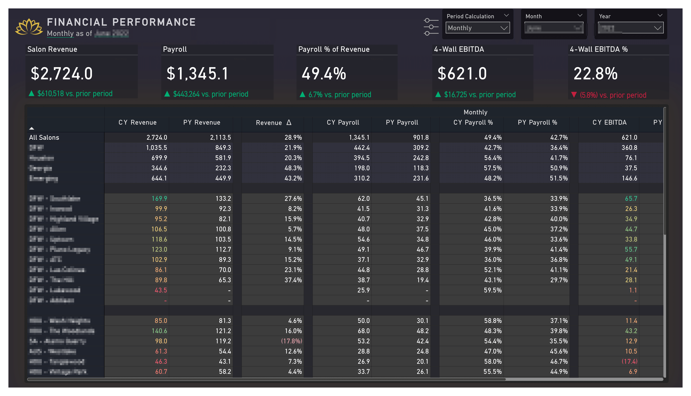

<!-- PROJECT LOGO -->
 

  

<h3 align="center">Wellness Salon - Financial P&L Dashboard</h3>

  

This comprehensive dashboard is designed to provide detailed insights into the financial performance of Lotus Wellness salons across various locations. It focuses on profit and loss metrics to help stakeholders understand the financial health of the business and identify areas for improvement.

  

<!-- TABLE OF CONTENTS -->

  
Table of Contents

  <ol>
    <li><a href="#about-the-project">About the Project</a></li>
    <li><a href="#built-with">Built With</a></li>
    <li><a href="#screenshots">Screenshots</a></li>
    <li><a href="#contact">Contact</a></li>
  </ol>

<!-- ABOUT THE PROJECT -->
## About The Project

<!-- [![Product Name Screen Shot][product-screenshot]](https://example.com) -->

The Lotus Wellness Financial P&L Dashboard is an essential tool for managing and understanding the financial performance of Lotus Wellness salons across various locations. This project aims to provide a clear and detailed view of the profit and loss metrics, enabling stakeholders to make informed decisions and identify opportunities for growth and efficiency improvements. 

The dashboard covers multiple aspects of financial performance, including revenue analysis, expense breakdown, and profit and loss summaries. By integrating data from all salon locations, the dashboard offers a comprehensive overview of the financial health of the business, highlighting key areas that require attention and optimization.

(<a href="#top">back to top</a>)

### Built With
###### Data Sources and Tools
* **Power BI**: The main tool for data visualization and dashboard creation, offering advanced features for interactive and real-time analysis.
* **Snowflake**: Used for processing and analyzing large datasets, leveraging its robust data warehousing capabilities.
* **dbt (data build tool)**: Used for transforming data within the warehouse, supporting efficient and scalable analytics workflows.

<!-- 
* [React.js](https://reactjs.org/)
* [Vue.js](https://vuejs.org/)
* [Angular](https://angular.io/)
* [Svelte](https://svelte.dev/)
* [Laravel](https://laravel.com)
* [Bootstrap](https://getbootstrap.com)
* [JQuery](https://jquery.com) -->

(<a href="#top">back to top</a>)

<!-- SCREENSHOTS -->
## Screenshots

**Financial P&L Dashboard Overview**: A detailed dashboard focused on the salon's profit and loss metrics.
- **Balanced Scorecard**: Summarizes key financial indicators such as revenue, expenses, and net profit.
- **Revenue Analysis**: Tracks revenue streams over time and identifies trends in client spending.
- **Expense Breakdown**: Details the salon's major expenses, helping to pinpoint areas for cost reduction.
- **Profit and Loss Summary**: Provides a clear view of the financial health by comparing current profits and losses to previous periods.
- **Trend Analysis**: Analyzes year-over-year and month-over-month financial performance to gauge growth and sustainability.

(<a href="#top">back to top</a>)

<!-- Image Stack with GitHub Links -->

<!-- Image with GitHub Link -->
<b>Financial Performance Overview</b> (1/6) 

  

(<a href="#top">back to top</a>)

<b>Balanced Scorecard</b>  (2/6) 

<!-- Image with GitHub Link -->

  

(<a href="#top">back to top</a>)

<b>Revenue Trend Analysis</b>  (3/6) 

<!-- Image with GitHub Link -->

  

(<a href="#top">back to top</a>)

<b>Profit & Loss Statement</b>  (4/6) 

<!-- Image with GitHub Link -->

  

 

(<a href="#top">back to top</a>)

<!-- Image with GitHub Link -->
<b>Average Comparison: Corporate vs Area</b>  (5/6) 

  

(<a href="#top">back to top</a>)

<!-- Image with GitHub Link -->
<b>YOY Variance</b>  (6/6)

  

(<a href="#top">back to top</a>)

<!-- CONTACT -->
## Contact

Portfolio Link: [https://shainalolin.com](https://shainalolin.com)

(<a href="#top">back to top</a>)

<!-- MARKDOWN LINKS & IMAGES -->
<!-- https://www.markdownguide.org/basic-syntax/#reference-style-links -->
[contributors-shield]: https://img.shields.io/github/contributors/github_username/repo_name.svg?style=for-the-badge
[contributors-url]: https://github.com/github_username/repo_name/graphs/contributors
[forks-shield]: https://img.shields.io/github/forks/github_username/repo_name.svg?style=for-the-badge
[forks-url]: https://github.com/github_username/repo_name/network/members
[stars-shield]: https://img.shields.io/github/stars/github_username/repo_name.svg?style=for-the-badge
[stars-url]: https://github.com/github_username/repo_name/stargazers
[issues-shield]: https://img.shields.io/github/issues/github_username/repo_name.svg?style=for-the-badge
[issues-url]: https://github.com/github_username/repo_name/issues
[license-shield]: https://img.shields.io/github/license/github_username/repo_name.svg?style=for-the-badge
[license-url]: https://github.com/github_username/repo_name/blob/master/LICENSE.txt
[linkedin-shield]: https://img.shields.io/badge/-LinkedIn-black.svg?style=for-the-badge&logo=linkedin&colorB=555
[linkedin-url]: https://linkedin.com/in/linkedin_username
[product-screenshot]: images/screenshot.png
[s1-screenshot]: images/Saffron-Autos-01.png
